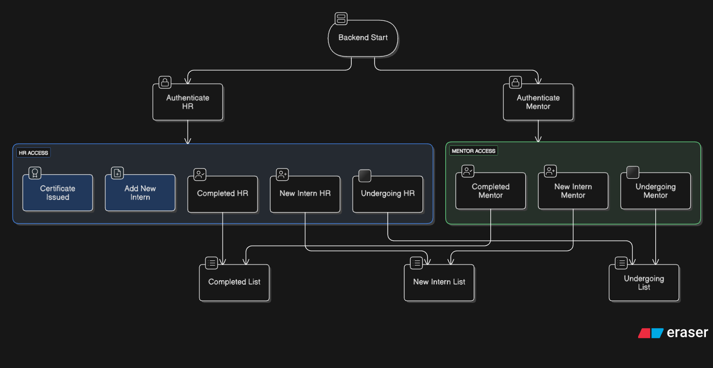
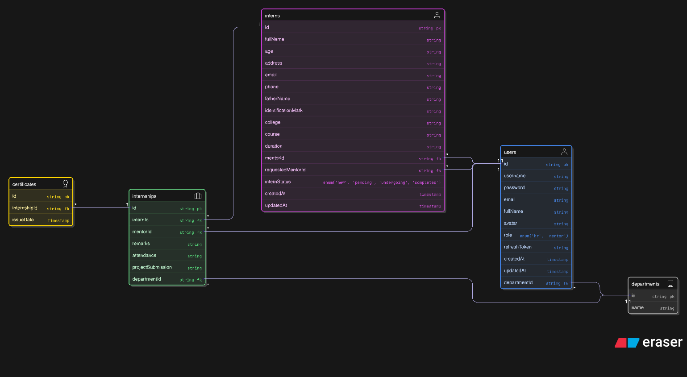

# 👥 Intern Management System

_Full-stack web application designed to streamline the internship lifecycle process — from onboarding to completion — with role-based dashboards for HR and Mentors._

[](https://intern-management-portal-alpha.vercel.app)

🔑 **Demo Access**  
HR: `john.doe@company.com` | Password: `securePass!2025`  
Mentor: `alice.smith@company.com` | Password: `mentorPass1CSE!2025`

⚠️ Note: Backend is hosted on Render free tier and may take a few seconds to wake up.  
🛠 Built with the MERN Stack | 🔐 JWT Authentication | ☁️ Cloudinary Integration

---

## 📑 Table of Contents
- [Overview](#-overview)
- [Problem Statement](#-problem-statement)
- [Core Features](#-core-features)
- [Tech Stack](#-tech-stack)
- [Security Implementation](#-security-implementation)
- [Project Architecture](#-project-architecture)
- [Environment Variables](#-environment-variables)
- [Installation \& Setup](#-installation--setup)
- [Demo Credentials](#-demo-credentials)
- [Future Improvements](#-future-improvements)
- [Author](#-author)

---

## 📌 Overview

The **Intern Management System** is a centralized platform that streamlines internship management within an organization.

It enables:

- HR to manage interns and assign mentors
- Mentors to track and update intern progress
- Structured internship status tracking
- Controlled certificate issuance
- Role-based authentication & authorization

This project replicates a real-world internship management workflow with structured lifecycle tracking and secure role-based access control.

---

## ❗ Problem Statement

Managing interns manually using spreadsheets and emails often results in:

- Data inconsistency  
- Lack of status visibility  
- Delayed communication  
- Manual certificate generation  
- No centralized tracking system  

This project solves these problems by introducing a **role-based automated workflow system**.

---

## ✨ Core Features

### 🔐 Role-Based Access Control (RBAC)
- Separate HR & Mentor dashboards
- Restricted actions based on user role

### 📊 Internship Lifecycle Management
Intern status flow:

```txt
New → [Assign Mentor] → Undergoing → Completed → Certification
```

### 🧑‍💼 HR Functionalities
- Add interns (form / CSV)
- Assign mentors
- View categorized intern lists
- Issue completion certificates
- Monitor progress

### 👨‍🏫 Mentor Functionalities
- Accept / Reject assigned interns
- Update internship progress
- Submit reports
- Mark interns as completed

### ☁️ Cloud Integration
- Cloudinary for media uploads
- MongoDB Atlas for cloud database


---

## 🛠 Tech Stack

### 🎨 Frontend
<p>


</p>

### ⚙️ Backend
<p>


</p>

### 🗄 Database
<p>


</p>

### 🧪 Development Tools
<p>


</p>

---

## 🛡 Security Implementation

- JWT-based Authentication
- Access & Refresh Token Strategy
- Protected Routes via Middleware
- Environment-based Configuration
- Cloudinary Secure Media Upload


---

## 🖼 Project Architecture

### 🔹 Project Flow Diagram



### 🔹 ER Diagram (Database Design)


---

## 🧑‍💻 Installation & Setup

If you prefer to run locally instead of using the live demo:


### 1️⃣ Clone Repository

```bash
git clone https://github.com/AdityanVerma/intern-management-portal.git
cd intern-management-portal
```

### 2️⃣ Install Dependencies

Backend: 
```bash
cd backend
npm install
```

Frontend:
```bash
cd frontend
npm install
```

### 3️⃣ Run the Application

Start Backend:
```bash
npm run dev
```

Start Frontend:
```bash
npm run dev
```

App runs at:
```bash
http://localhost:3000
```

---

## 🔐 Environment Variables

Create a `.env` file inside the `backend` directory and add:

```
PORT=7000
CORS_ORIGIN=*

MONGODB_URI=your_mongodb_connection_string

ACCESS_TOKEN_SECRET=your_access_token_secret
ACCESS_TOKEN_EXPIRY=1d

REFRESH_TOKEN_SECRET=your_refresh_token_secret
REFRESH_TOKEN_EXPIRY=10d

CLOUDINARY_CLOUD_NAME=your_cloud_name
CLOUDINARY_API_KEY=your_cloudinary_api_key
CLOUDINARY_API_SECRET=your_cloudinary_api_secret
```

---

## 🔑 Demo Credentials

HR Login  
Email: hr@test.com  
Password: 123456


---

## 🔮 Future Improvements

- Performance Optimization & Code Refactoring
- Certificate Generation
- Role Hierarchy Expansion (Admin Panel)
- Automated Email Notification System
- PDF / Excel export
- Docker support

## 👨‍💻 Author

Adityan Verma | Web Developer


GitHub: https://github.com/AdityanVerma

LinkedIn: https://www.linkedin.com/in/adityan-verma/

Email: adityanvermaa@gmail.com